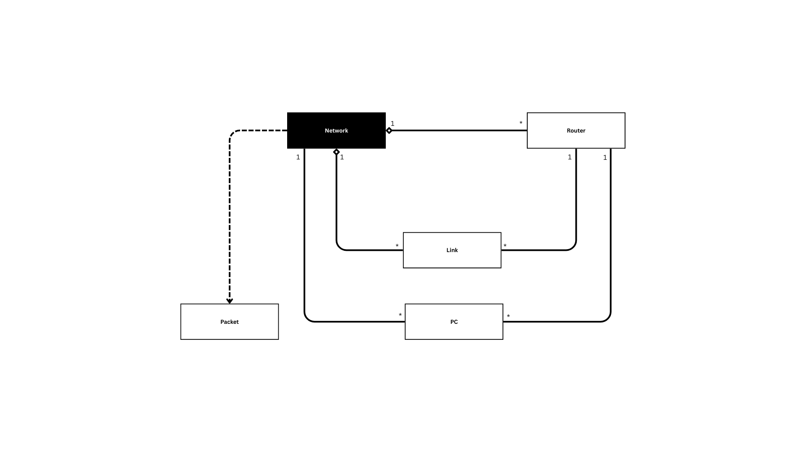

<a name="readme-top"></a>


# Project Structure Guide

## File Organization

```
Network Packet Routing Simulation/
├── Utilities & Constants
│   ├── common.h              ← Shared includes and ANSI color codes
│
├── Data Models (Core Classes)
│   ├── link.h                ← Graph edges (connections between routers)
│   ├── router.h              ← Graph vertices (network nodes)
│   ├── packet.h              ← Data transmission unit
│   ├── pc.h                  ← Network endpoints (computers)
│   └── network.h             ← Main network class with graph algorithms
│
├── User Interface
│   ├── networkController.h   ← All menu and user interaction functions
│   └── main.cpp              ← Clean menu loop entry point
│
|
Documentation:
├── Project Report
|   ├── PROJECT_REPORT.md     ← Complete PROJECT details
|
├── Structure Guide
|   ├── STRUCTURE_GUIDE.md    ← Complete PROJECT structure
            
└── README.md                 ← Project overview
```

## Class Hierarchy

```
Network                          (Main container / Controller)
  ├── vector<Router>             (Graph vertices representing routers)
  ├── vector<PC*>                (End devices connected to the network)
  ├── vector<vector<Link>>       (Adjacency list representing network links)
  ├── vector<vector<int>>        (Distance matrix for shortest path computation)
  └── vector<vector<vector<int>>> (Paths matrix storing reconstructed routes)

Router                           (Graph node)
  ├── id: int                    (Unique router identifier)
  └── status: bool               (Active / Failed state)

Link                             (Graph edge)
  ├── connectedRouter: int       (Destination router ID)
  ├── distance: int              (Link cost / weight)
  ├── isBiDirectional: bool      (Directional property)
  └── status: bool               (Active / Failed state)

PC                               (Network endpoint)
  ├── pcID: int                  (Unique PC identifier)
  ├── connectedRouterID: int     (Router to which PC is attached)
  └── status: bool               (Active / Offline state)

Packet                           (Data unit)
  ├── id: int                    (Packet identifier)
  ├── sourcePC: int              (Source PC ID)
  ├── destPC: int                (Destination PC ID)
  ├── currentRouterID: int       (Router currently handling the packet)
  ├── path: vector<int>          (Computed routing path)
  └── status: PacketStatus       (Delivered / Dropped / In-Transit)

```

---
## Class Diagram

```

```
---

---

## Data Flow Example

```
User Input (Menu / UI Handler)
    ↓
User selects "Send Packet" option
    ↓
Input validation (Source PC ID, Destination PC ID)
    ↓
Function Call (sendPacket)
    ↓
Network Class (transmitPacket)
    ↓
Lookup Source PC and Destination PC
    ↓
Validate PC and Router status
    ↓
Shortest Path Computation (Dijkstra’s Algorithm)
    ↓
Path Reconstruction from Paths Matrix
    ↓
Packet Forwarding Router-by-Router
    ↓
Packet Status Update (Delivered / Dropped)
    ↓
Display Result to User
    ↓
Return to Main Menu

```

---

## Dependency Graph
High-level module dependencies:
- `Utilities` (lowest) —> `Data Models` (packet, link)
- `Data Models` —> `Node Modules` (`router`, `pc`)
- `Node Modules` —> `Network` (Core Manager)
- `Network` —> `User Interface` (`NetworkController`)

Textual Dependency DAG:
```
Utilities / common.h
  ↓
packet.h, link.h
  ↓
router.h, pc.h
  ↓
network.h
  ↓
User Interface / networkController.h, main.cpp
```


<p align="right">(<a href="#readme-top">back to top</a>)</p>   